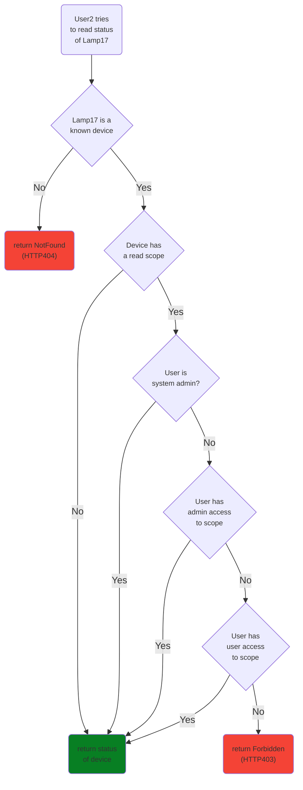

## Access Control

The KosmoS Platform has advanced access control which include access control based specific users, groups and scopes.
A user that creates a Device will be the automatically added with admin access for the device.

???+ check "stable"
    This core feature is stable and heavily tested in production use.
